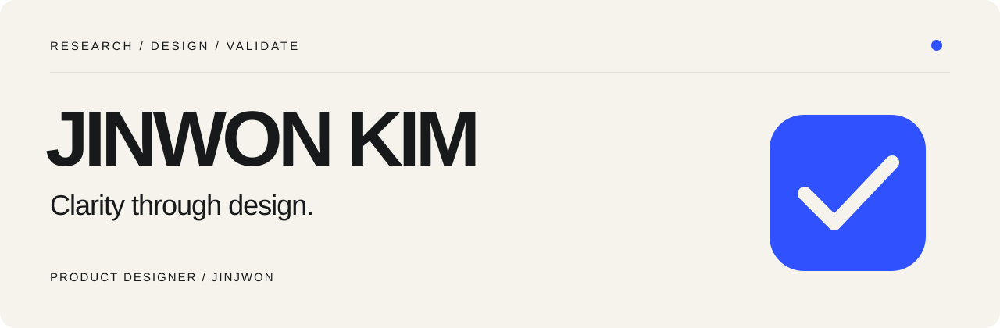

### 사용자가 이해하고 판단할 수 있는 경험을 설계합니다.

안녕하세요, 프로덕트 디자이너 김진원입니다.  
프론트엔드에서 시작해 UI/UX 디자인으로 영역을 넓혔습니다. 사용자 근거로 문제를 정의하고, 정보 구조와 인터랙션을 설계하며, 프로토타입과 개발 협업으로 구체화합니다.

 

## Selected projects

### 01 — VENDIT
**추천 가격보다, 판단할 수 있는 근거를 먼저.**

숙박 운영자가 여러 예약 사이트를 오가며 객실 가격을 비교하는 문제에서 출발했습니다. 운영자 리서치를 바탕으로 자동 추천 중심의 가설을 수정하고, 시장 비교 → 추천 근거 확인 → 직접 가격 결정으로 이어지는 RMS 경험을 설계했습니다.

**내 기여** · 4인 팀의 팀장·프로덕트 디자이너로 리서치, UX 전략, UI 설계와 프로토타이핑에 참여했습니다. Framer로 가격 입력·저장·변경값 반영을 구현하고 운영자 검증으로 연결했습니다.

검증 범위 · 운영자 1명의 정성적 관찰. 조사 시간 단축이나 매출 개선을 입증한 결과는 아닙니다.

 

### 02 — WALLA
**설문 제작이 멈추는 지점을 찾아, 조건 설정을 이해하기 쉽게.**

설문 제작 1,603건 중 511건이 발행 전에 중단된 데이터에서 출발했습니다. 사용자 관찰로 조건 설정의 찾기·설정·확인 장벽을 좁히고, 팀과 함께 단계적인 설정 경험을 설계했습니다.

**내 기여** · 5인 팀의 PM·팀장으로 문제 정의와 가설 변화를 관리했습니다. 기능정의서, 검증계획서, 분석보고서, 최종 IA·User Flow를 직접 작성하고 UT 미션과 성공 지표를 설계했습니다.

검증 범위 · MAZE 사전 사용자 테스트를 개선 방향의 근거로 활용. 출시 후 이탈률 감소를 측정한 성과는 아닙니다.

 

### 03 — GOGO
**경기 사이에도, 다시 참여할 이유가 있는 체육대회.**

채팅방에서 경기 소식을 찾아보던 경험을 경기 상태와 다음 행동이 보이는 서비스로 연결했습니다. 메인 스테이지, 팀 신청, 미니게임의 흐름과 상태·예외 화면을 설계했습니다.

**내 기여** · 14인 프로젝트에서 UI/UX 디자인을 단독으로 담당했습니다. 개발자와 구현 가능성을 조율하고 실제 기기의 Design QA, 출시 전후 화면 개선과 운영 이슈 대응까지 이어갔습니다.

핵심 경험 · UI/UX 설계 · 개발 협업 · Design QA · 실서비스 운영 대응

 

### 04 — PAWCE
**훈련 데이터를 읽는 경험에, 일관된 디자인 기준을.**

반려견의 이동 경로와 속도 변화를 바탕으로 어질리티 훈련의 약점 구간을 파악하도록 설계한 서비스입니다. 기록을 보여주는 데서 나아가, 문제 구간을 이해하고 다음 훈련을 판단하는 경험을 다뤘습니다.

**내 기여** · 5인 팀에서 브랜딩과 디자인 시스템 구축을 중심으로 참여했습니다. 공통 컴포넌트와 시각적 기준을 정리하고, 3명의 디자이너가 만든 화면의 일관성을 맞췄습니다.

핵심 경험 · Branding · Design System · UI/UX Design · Prototype

 

## How I work

**문제의 크기와 원인을 함께 봅니다.**  
데이터로 어디에서 막히는지 확인하고, 사용자 관찰로 왜 막히는지 좁혀갑니다.

**화면보다 판단의 흐름을 먼저 설계합니다.**  
사용자가 무엇을 이해하고 다음에 어떤 행동을 해야 하는지 기준을 세웁니다.

**설계가 실제 경험이 될 때까지 연결합니다.**  
프로토타입, 개발 협업, QA를 통해 의도가 구현에 반영되는지 확인합니다.

 

**Tools** &nbsp; Figma · Framer · Illustrator · Photoshop · Blender · MAZE

---

김진원 · Product Designer / Clarity through design.
