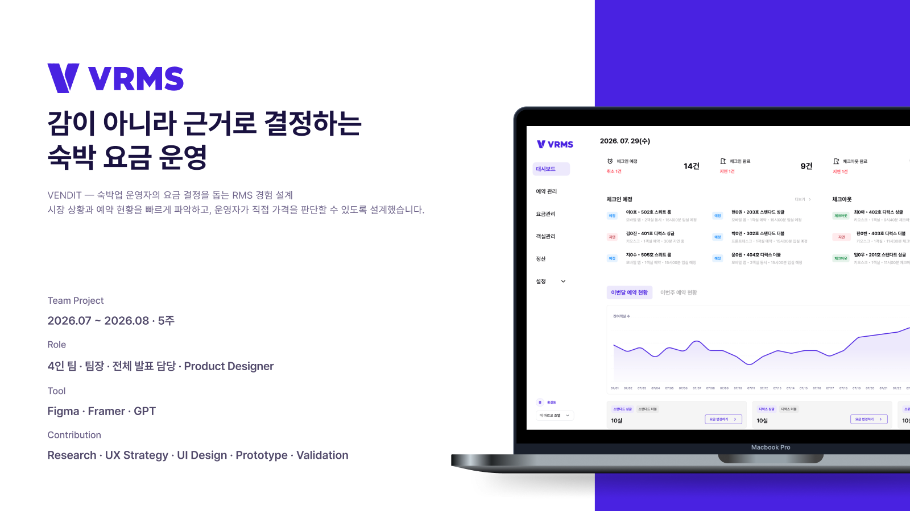
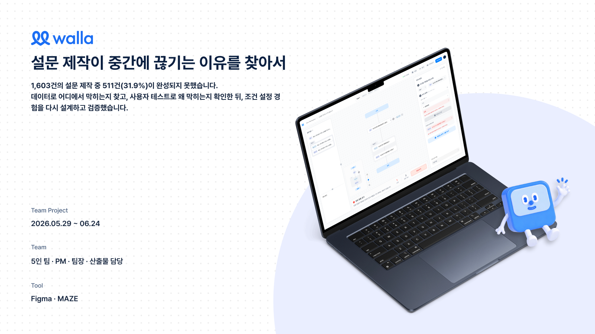
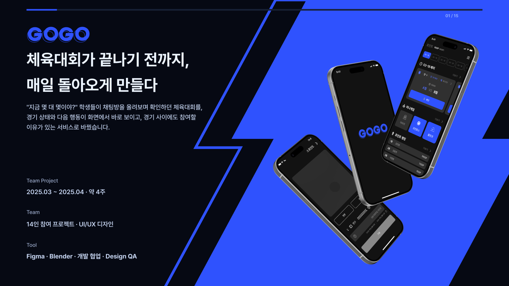
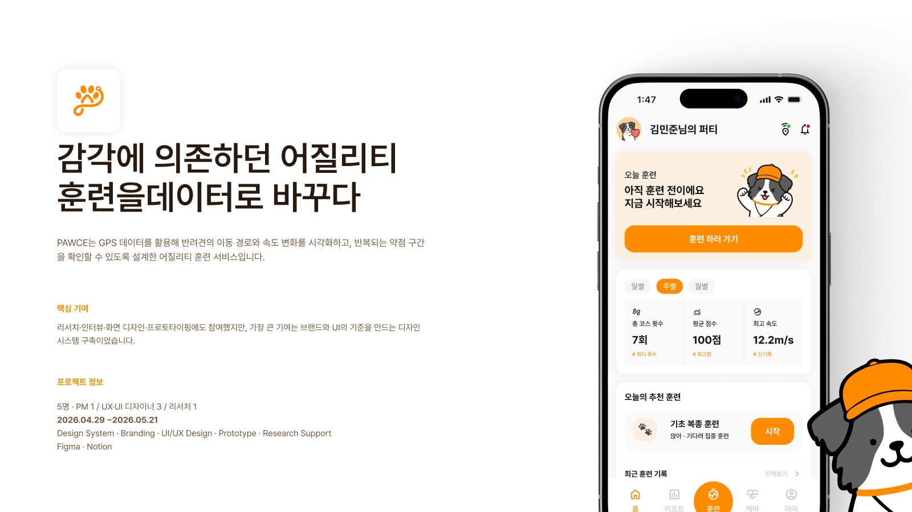

### 김진원 · Product Designer

사용자 리서치를 바탕으로 문제를 정의하고, UI/UX 설계부터 프로토타입·개발 협업까지 연결합니다.

## 프로젝트

<table>
<tr>
<td width="50%" valign="top">

<h3>VENDIT · 숙박 요금 관리</h3>

<strong>팀장 · Product Designer</strong> 운영자 리서치 · 요금 결정 UX · Framer 프로토타입

</td>
<td width="50%" valign="top">

<h3>WALLA · 설문 제작</h3>

<strong>Product Designer</strong> 문제·가설 정의 · IA·User Flow · UT 설계

</td>
</tr>
<tr>
<td width="50%" valign="top">

<h3>GOGO · 체육대회 서비스</h3>

<strong>단독 UI/UX 디자이너</strong> 화면·인터랙션 설계 · 개발 협업 · QA·출시 대응

</td>
<td width="50%" valign="top">

<h3>PAWCE · 반려견 훈련</h3>

<strong>브랜딩 · 디자인 시스템</strong> 브랜드·공통 컴포넌트 · 팀 화면의 일관성 정리

</td>
</tr>
</table>

## 도구

Figma · Framer · Illustrator · Photoshop · Blender
